# What's new

What changed in each release of What To Do, newest first.

## 1.25.0 — 2026-11-18

Venues that post only on Instagram now reach your feed.

### Instagram profiles
Add a public Instagram profile the same way as a channel: paste `instagram.com/name` and the app shows the profile with what it will read. **Refresh** then reads its posts, with every photo of a carousel, and its pinned stories, the highlights under the profile, where many venues keep their weekly program. It also takes a few frames from every video, so text that appears later in a reel or a story is read too. No Instagram account or login is needed.
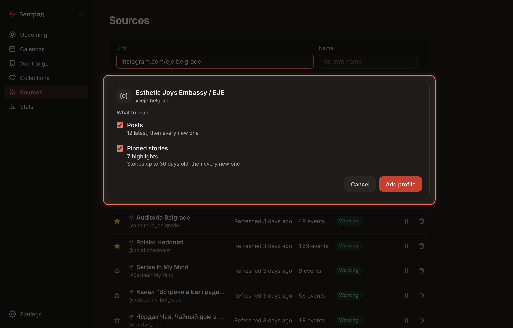

The first refresh takes stories from the last 30 days, then every new one, so old highlights don't flood the feed. Each profile in **Sources** has its own **Posts** and **Pinned stories** switches: turn one off and it is no longer read, while the cards it already brought stay.
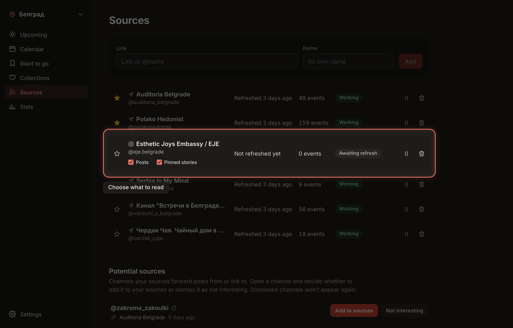

Stories that disappear after 24 hours and the sound of videos are not read: Instagram shows them only to signed-in visitors.

### New
- A bare name such as `@londonevents` asks whether it is a Telegram channel or an Instagram profile.
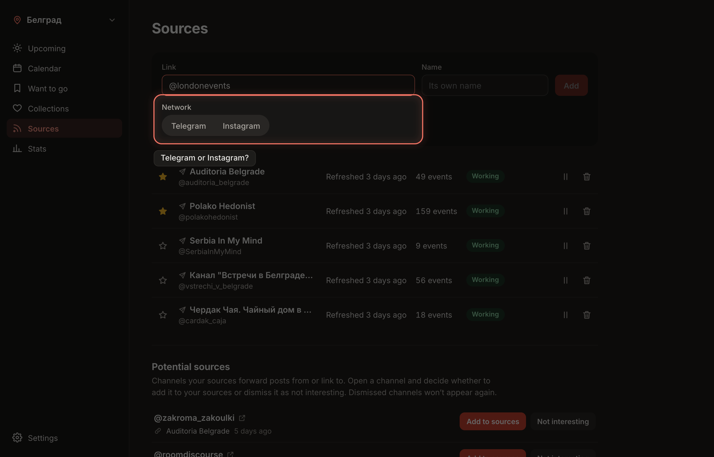

### Improvements
- The link to the original says where it leads: **Open post in Telegram**, **Open post on Instagram** or **Open highlight on Instagram**.

## 1.24.0 — 2026-11-18

Keep the events worth remembering.

### Collections
Make your own sets of events to keep, such as the funniest or the most unusual ones. Turn them on in **Settings → Advanced → Collections** and add a collection. Each card then has a heart in its top-right corner: click it and tick the collections the event goes into. The heart fills in while the event is in a collection. The event window has the same heart.
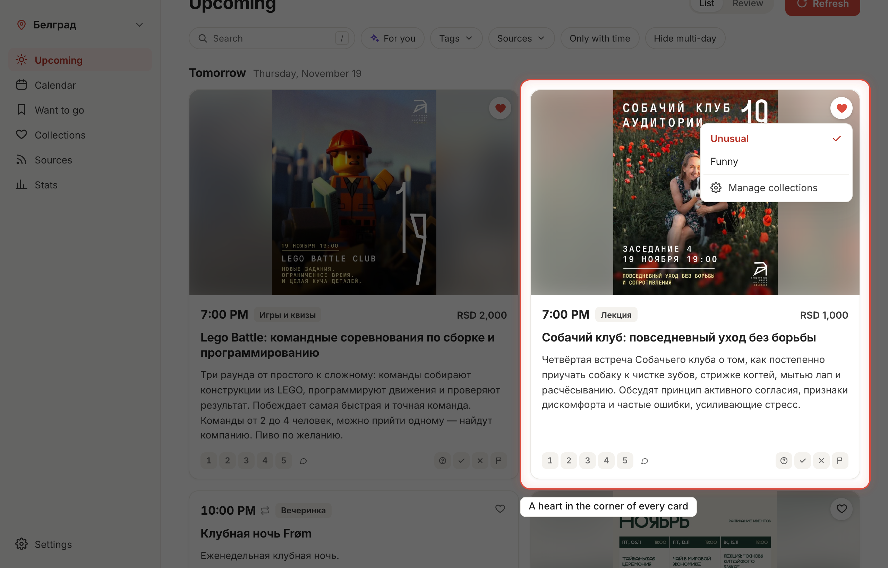

**Collections** in the menu shows one collection at a time as the usual feed with the usual filters. Past events stay in it, and a regular event appears there once, on its next date. Your marks don't change what it shows. Turning collections off only hides them, and deleting a collection leaves its events in the feed.
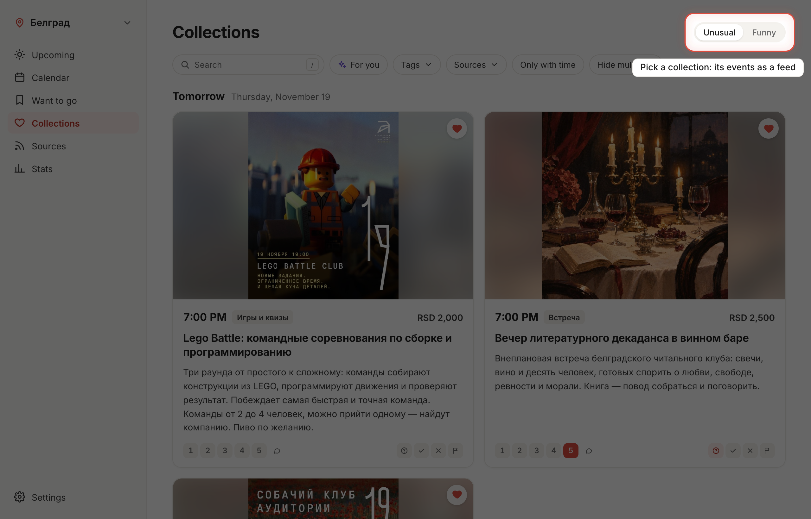

### Fixed
- Esc in a menu inside the event window closes only the menu, not the whole window.

## 1.23.0 — 2026-11-17

A digest line gets the whole announcement it links to.

### Posts a digest links to
Many channels post a weekly digest where each line is a title and a link to the full post. **Refresh** now opens those linked posts, in the same channel or in any other public channel, and reads them too, however old they are. Each digest line joins the card of the post it links to, so the card shows that post's poster, description and price instead of one line. A recurring event, such as one every Saturday, stays one recurring card, and every week's digest line joins it. Links inside a linked post are not followed.
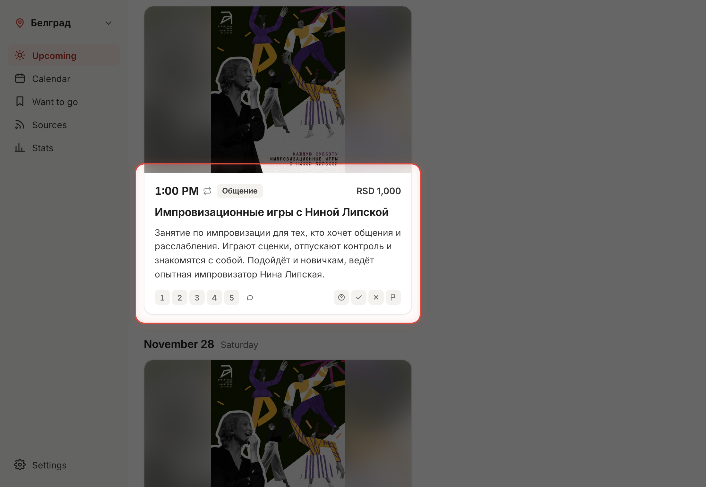

### Fixed
- A recurring event no longer turns into a one-day event when a post names one of its dates.
- The latest posts of every channel are read again at the next **Refresh**, so digest lines already in the feed join the cards of their posts. A line you rated or planned stays on its own card.

## 1.22.2 — 2026-11-17

Other websites can no longer use the app.

### Fixed
- The app's server on your computer answered requests from any website open in your browser, so a page could, in theory, read your feed, change marks or start a refresh. It now answers only its own window and pages.

## 1.22.1 — 2026-11-17

The macOS app with the phone page, for Intel Macs too.

### Fixed
- The disk image for Intel Macs builds again, so the macOS app gets the phone page from 1.22.0 on both Apple Silicon and Intel.

## 1.22.0 — 2026-11-17

Your plans on the phone.

### Want to go, on your phone
The app runs on your computer, but your plans can now go with you. Turn on **Settings → Phone page** and the app keeps a copy of **Want to go** on a GitHub Pages site of your own: the same cards, filters and event window, without the buttons that change anything. The site is public, so everything on it is encrypted with a password you choose; the phone asks for it once and remembers it. While the app runs, it updates the page by itself, at most once every 10 minutes, and the page shows when it was last updated.
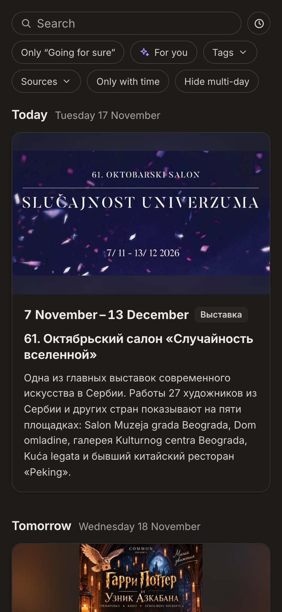

### New
- **Settings → Phone page** walks you through a free GitHub repository, a token limited to it and turning GitHub Pages on, then shows the page link with a QR code for the phone.
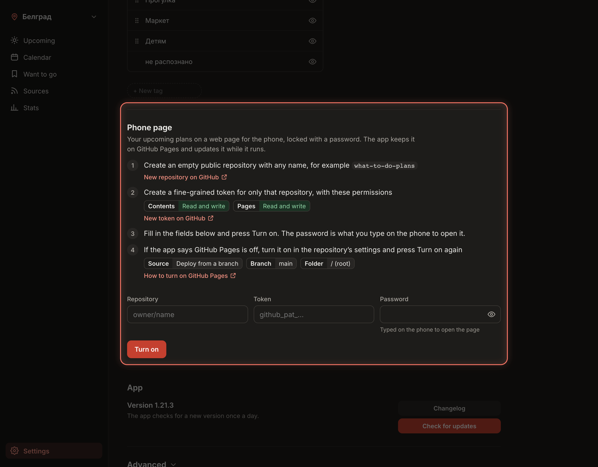

## 1.21.3 — 2026-11-17

An honest note for Linux and Windows.

### Improvements
- The install guide says the app hasn't been tried by hand on Linux and Windows, and asks anyone who does to report how it went or send a fix.

## 1.21.2 — 2026-11-17

A tidier README.

### Improvements
- The README opens with what the app does; the warning about the first launch on a Mac now sits only in the macOS install steps, where you meet it.

## 1.21.1 — 2026-11-17

Clearer first-launch steps on a Mac.

### Improvements
- The install guide says up front that macOS blocks the app's first launch, and shows how to open it with **Open Anyway** in **Privacy & Security**. The app isn't broken when this happens.

## 1.21.0 — 2026-11-17

What To Do starts even when another program already uses its port.

### Improvements
- When another program holds the app's port, What To Do moves to a free port next to it and keeps using it, instead of stopping with "Couldn't Start". A port you set yourself with `PORT` in `.env` stays as it is.
- The Mac app from the disk image now starts on port 48765, which other programs rarely use. After the update it opens on the new port once, so the window's own preferences, such as the theme, start from their defaults again.

## 1.20.0 — 2026-11-17

Filters tell the truth and stay where you put them.

### Filters you can trust
The **Tags** and **Sources** lists show what is really in the feed: when every tag counts, every box is ticked, with **All tags** on top to come back to that. Untick what you don't want, or hover a row and click **Only** to keep just that one.
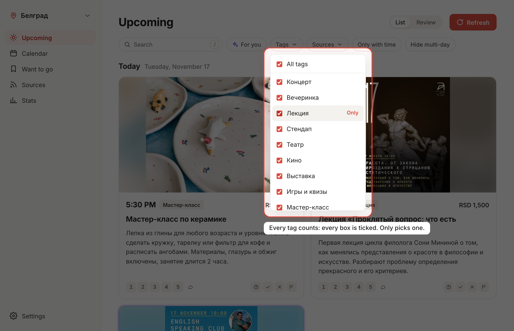

### Filters stay put
Tags, sources, **For you**, **Only with time** and **Hide multi-day** now follow you from Upcoming to Calendar and Want to go, and are still there after the app restarts. The search is a quick look and starts empty each time.
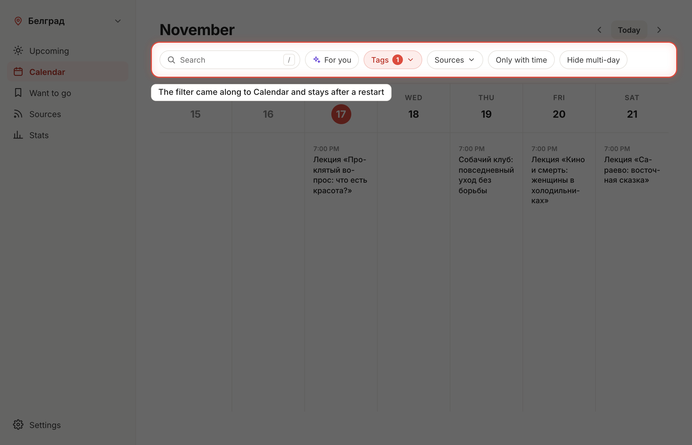

### Fixed
- A filter list near the right edge of the window opens to the left instead of being cut off.

## 1.19.0 — 2026-11-17

What To Do installs on a Mac like any other app now: download a disk image, drag it to Applications, done.

### A Mac app you just download
There is a disk image for Apple Silicon Macs and one for Intel Macs on the release page. Everything the app needs is inside: no Terminal, no Python, no Node.js, no git. Open the image and drag What To Do to Applications. The first time, macOS asks you to allow the app once in System Settings, Privacy & Security; the README shows each step. Your events stay in the same folder as before, and **Update** in the app downloads the next version and replaces itself.
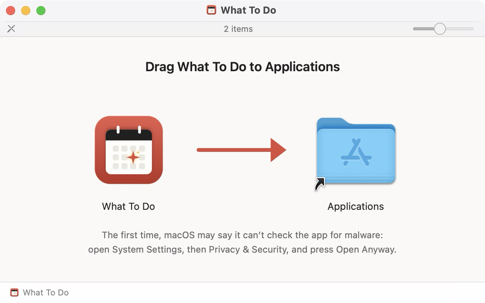

### Sign in to Claude from the app
When Claude isn't signed in, the note under **Refresh** now has a **Sign in to Claude** button instead of terminal steps. The sign-in page opens in your browser and the app picks up the login by itself. If the browser didn't open, the note links to the page and takes the code it shows.
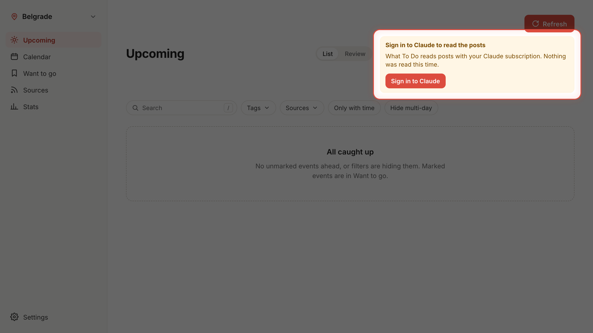

### Improvements
- Installing from the code is one step shorter: `git clone`, then `uv run where-to-go up` installs everything by itself.

## 1.18.0 — 2026-11-17

Settings are tidied up: what everyone needs comes first, expert knobs wait under Advanced.

### Clearer settings
Settings now read top to bottom from what matters most: **Cities**, **Appearance**, **Your feed** (what you look for first and the tags) and **App**. Each group says in plain words what it does and when to change it. Recent posts per channel, Claude models and Claude prompts moved under **Advanced**, which stays closed until you open it and is safe to ignore. Every setting works and is stored as before.
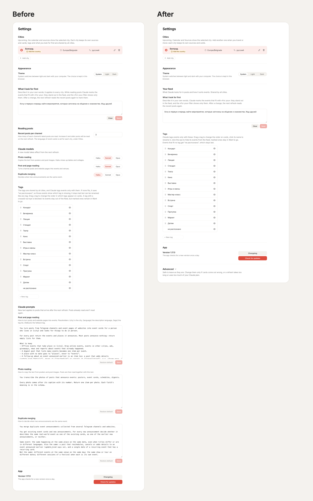
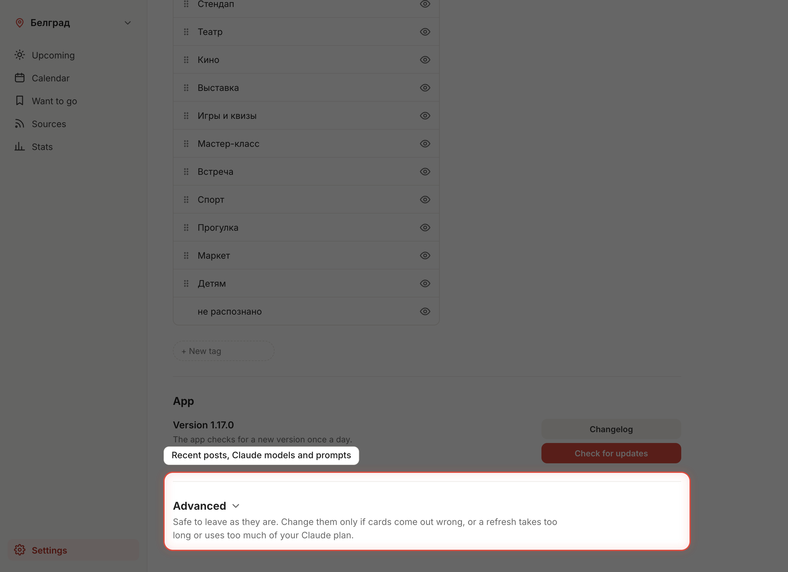

## 1.17.0 — 2026-11-17

What To Do now has a dark theme.

### Dark theme
Every screen, window and menu has a dark look: the feed, event cards and the event window, the calendar, sources, stats, settings, What's new and the first-run screens. By default the app follows your computer and switches the moment it goes light or dark; the macOS app's window follows it too.
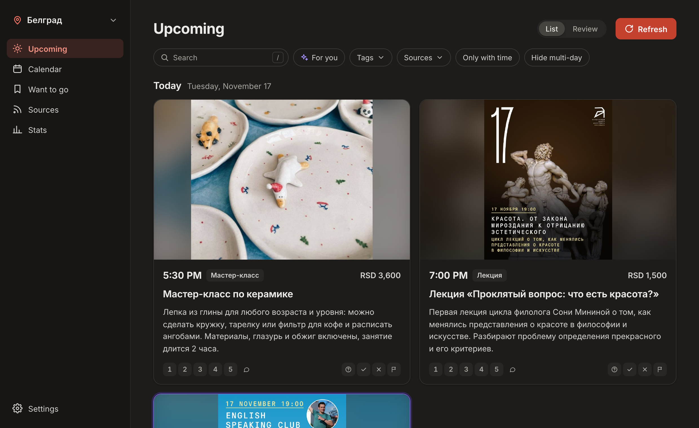
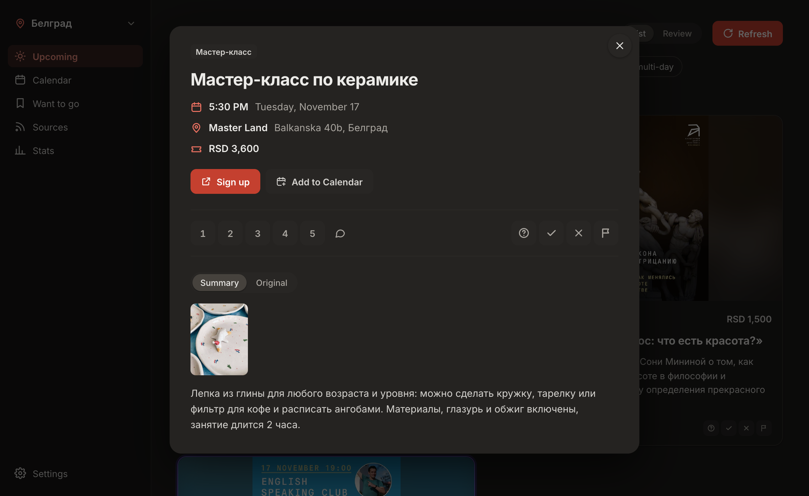

### New
- **Settings → Appearance → Theme** chooses System, Light or Dark. The choice is kept in your browser, and the page opens in it without a flash of the other look.
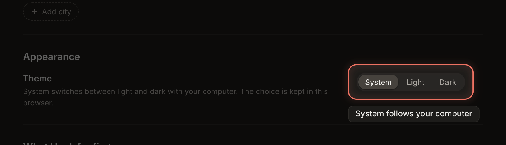

## 1.16.1 — 2026-11-17

What To Do is now open source under the MIT license.

### Improvements
- The repository has a license: you may use, change and share the app under the terms of the [MIT license](LICENSE).

## 1.16.0 — 2026-11-16

What To Do is ready for anyone: on macOS, Linux and Windows, in any city and any language.

### Any city, any language
Each city now has a country, a time zone and its own language of event cards. A new app asks for all four on its first screen and fills in the time zone and the language from your computer, so cards come out in your language from the first refresh. Cities can be edited and deleted in **Settings → Cities**. Map links and calendar files add the city and the country to the address, so a street name opens in the right place.

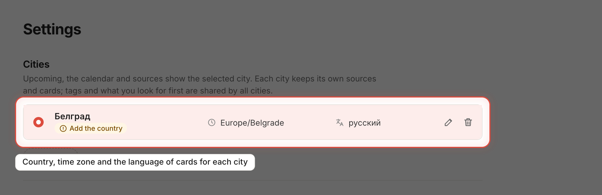

### Runs the same way everywhere
`uv run where-to-go up`, `down`, `status`, `logs`, `update` and `uninstall` work the same on macOS, Linux and Windows. `down` stops the app and every Claude call it started. `uninstall` stops the app, removes the macOS app and, if you agree, your data, and tells you the last step. The data lives in your system's usual folder for app data. The **Update** button restarts the app with the same port and data, however you started it.

### New
- An empty **Sources** list shows how to find channels and websites for your city.

- Before the first refresh **Upcoming** says the sources are waiting to be read and offers **Refresh now**.
- When Claude Code is not signed in, the refresh says how to sign in: run `claude` in a terminal and type `/login`.

### Improvements
- New apps start with tags in the language of their first city, and the tag for events Claude could not sort, **Other** in English, can be renamed like any other.
- Changing the language of cards reads recent posts again, so the feed doesn't mix languages.
- Dates, times and the first day of the week follow your region: 12-hour time and Sunday weeks where that is the custom.
- The README explains what the app does, how to install, run, stop, update and remove it, and the first steps.

### Fixed
- A channel that changed its name no longer suggests itself under **Potential sources**.
- Adding a city with a name that already exists says so instead of failing.
- Websites in cities on UTC (London, Lisbon) no longer get event times an hour off in summer.

## 1.15.3 — 2026-11-16

The window always opens the version you installed.

### Fixed
- After an update the app window could keep showing the previous version for up to a few hours, even after quitting and reopening the app or pressing **Restart for update**: new features were missing and recent ones could even disappear until you pressed Cmd+R. The window now checks with the app on every start and always opens the installed version.

## 1.15.2 — 2026-11-16

A **Review** card shows what a card in the list shows.

### Fixed
- A **Review** card no longer adds its own details. It shows the time, one tag, the price, the title and the description, just as the list does, and no longer the place or extra tags. The day sits above the card, as a heading in the list does.
- The rating row on a **Review** card lost its **Interest** label and gained the **Note to developer** button the list card has.

## 1.15.1 — 2026-11-16

Digests are read in full.

### Fixed
- A channel that posts long digests of many events no longer loses part of them: several digests read together made Claude skip a third or more of their events, sometimes a whole digest. A long post is now read with short posts only or on its own.
- The latest posts of every channel are read again at the next **Refresh**, so the events they lost appear. Your ratings and plans stay on their cards.
- Quitting the app stops reading. Before, the app could close while **Refresh** kept running in the background and kept calling Claude. Now quitting stops the refresh and Claude's calls with it. The window shows **Stopping…** for a few seconds. Posts already read stay, and the rest are read at the next **Refresh**.

## 1.15.0 — 2026-11-16

Sources can be paused instead of deleted.

### Pause a source
A source you no longer want new events from can be paused with the pause button next to **Delete** in **Sources**. **Refresh** skips a paused source, and its events you have not marked leave **Upcoming**, **Calendar** and **Stats**. Events you have rated or planned stay, and so do events another source also announces. Press the play button to resume it: its hidden events come back.
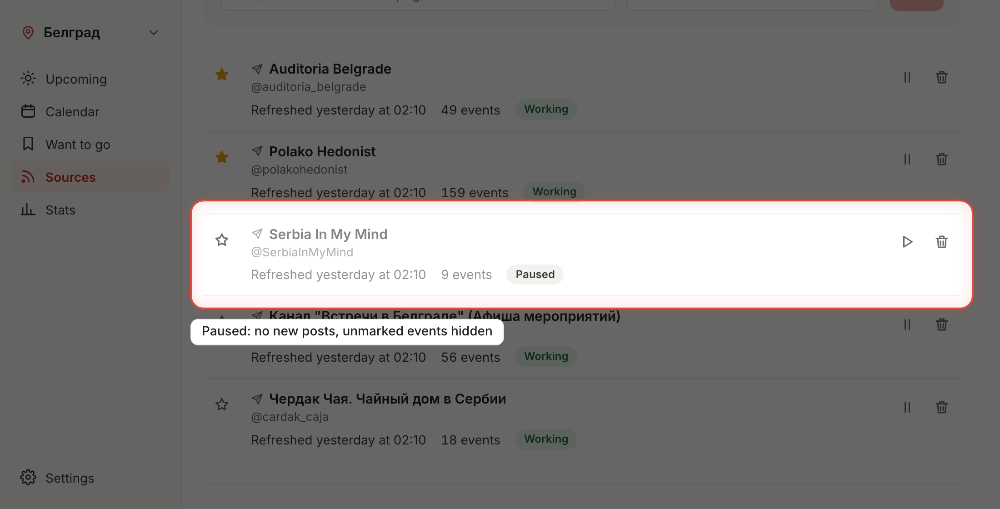

## 1.14.3 — 2026-11-16

Long tooltips fit in the window.

### Fixed
- A long tooltip wraps onto several lines instead of running off the window. This was most visible on **For you**, whose tooltip quotes what you wrote in **Settings**.

- In **Review**, the tooltip on a card's **For you** badge is no longer cut off at the card's edge.
- In a small window, a **Review** card fits its answers and no longer cuts the description in the middle of a line.

## 1.14.2 — 2026-11-16

Tooltips are shown in full.

### Fixed
- Tooltips on a card's ratings and on the repeat and unknown-time icons are no longer cut off at the card's edge. A rating at the left edge used to show only part of its words, such as "…nteresting at all".
- Tooltips on the **Statuses** bar in **Stats** are no longer cut off by the bar.

## 1.14.1 — 2026-11-16

Review mode follows the same rules as the list.

### Fixed
- In **Review**, a rating no longer takes the card away. A card leaves the deck only when it leaves **Upcoming**, after **Not going**, **Maybe** or **For sure**. Rated cards that have no plan yet show up in Review too, just as they do in the list.
- Choosing a card's current rating or plan again clears it, as on the cards in the list.
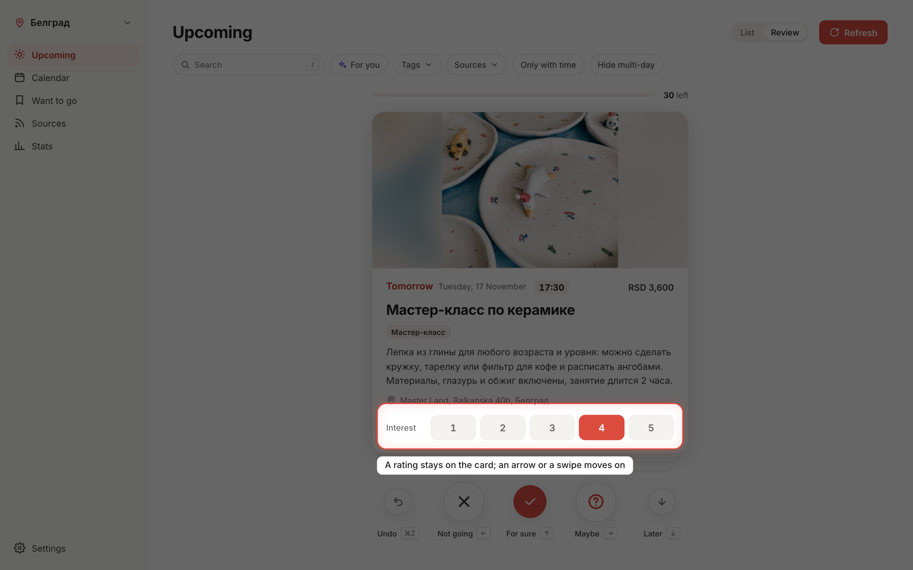

## 1.14.0 — 2026-11-16

Tell Claude what you look for first, and those events stand out.

### For you
In **Settings → What I look for first**, describe in your own words what matters to you most, for example «I'm looking for friends: events made for meeting people». While reading posts, Claude marks the events that fit with **For you**: their cards get a violet frame and badge in the feed, in **Review** and in the event window, and they are tinted in the **Calendar**. The **For you** filter next to the search shows only them. After you change the wish, the next **Refresh** reads the recent posts again so the cards already in the feed get marked too.

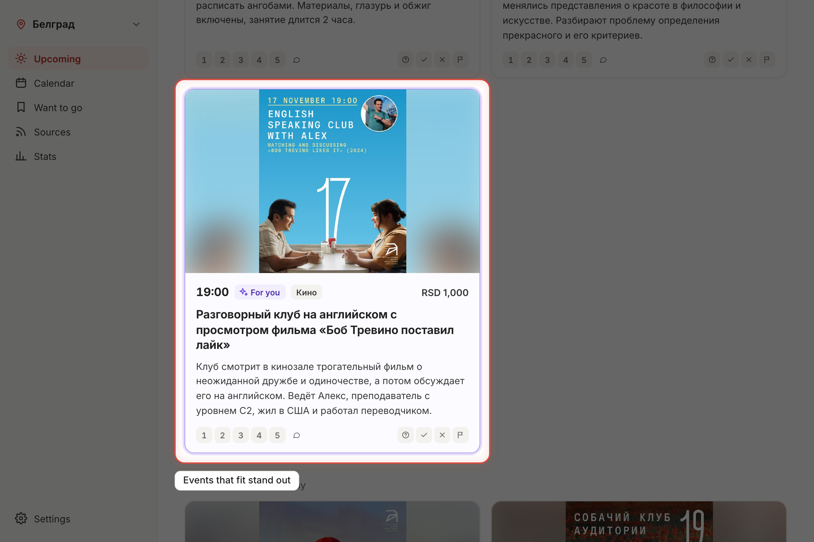

## 1.13.0 — 2026-11-16

Go through the feed one card at a time, like a dating app.

### Review mode
Switch **Upcoming** from **List** to **Review**: one event fills the screen, and every answer brings the next. Drag the card right or press → for **Maybe**, left or ← for **Not going**, up or ↑ for **For sure**. Keys 1–5 set your interest and move on too, ↓ leaves a card for later, and ⌘Z or the **Undo** button takes the last answer back. A click on the card opens the whole event. The buttons under the card do the same with the mouse, and the app remembers which view you used last.
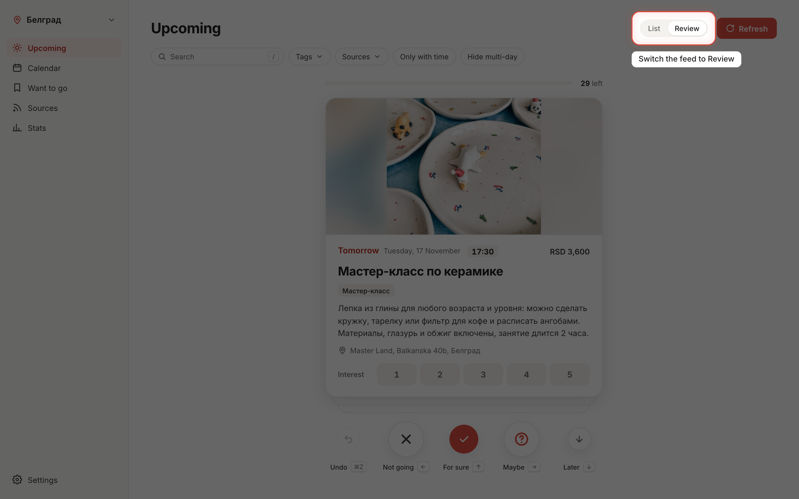

## 1.12.0 — 2026-11-16

The app now speaks English. Your events, tags and prompts stay as they were.

### English interface
Every screen, button, hint and message is in English: the sidebar, filters, the event window, stats, settings, the **Refresh** progress, errors and the update steps. The macOS app's menus and windows are in English too. Claude still writes event titles and descriptions in the language set in **Settings**, and your tags keep their names.
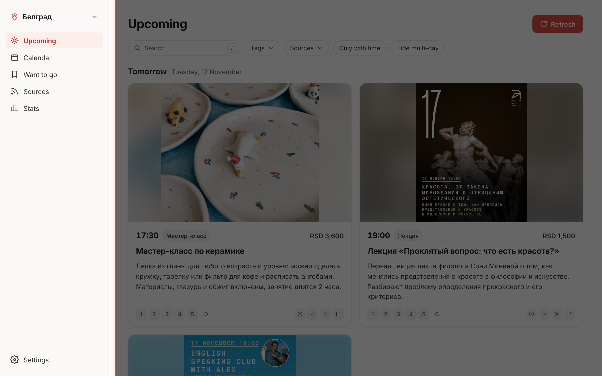

### Improvements
- Dates read the English way, such as **Tuesday, 17 November**, and prices as **RSD 1,500**.
- The section of events you plan to attend is called **Want to go**.

## 1.11.1 — 2026-11-16

Merging duplicates shows its progress, and website pages are no longer called posts.

### Improvements
- While duplicates are merged, the **Refresh** button counts announcements and shows roughly how long is left.
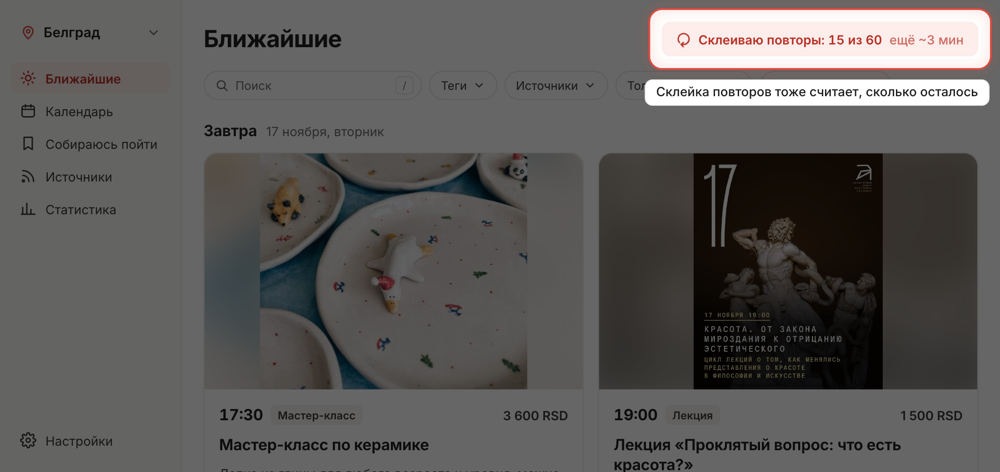
- Website pages are no longer called posts. The **Collecting sources** and **Reading posts and pages** labels on the button, the event window and the stats speak of sources, posts and pages.

## 1.11.0 — 2026-11-16

While a refresh runs, you can see how much is done and roughly how long is left.

### Refresh progress
The **Refresh** button counts every stage: how many sources are collected, how many website pages are downloaded, how many photos and posts are read. Next to it you see roughly how much time is left, judged by how fast the current stage goes.

## 1.10.2 — 2026-11-16

Event dates and places from websites now match the website exactly.

### Improvements
- The app takes the date, time, place and price of a website event straight from the page rather than from Claude's retelling, so they can no longer get mixed up. Claude writes only the title, description and tags.

## 1.10.1 — 2026-11-15

Event websites use less Claude and are read more reliably.

### Improvements
- Website events in other cities and online events no longer go to Claude. The app asks Claude once which place names belong to your city and remembers the answer.
- The website preview shows how many events the site has and which of them will make it into the app.
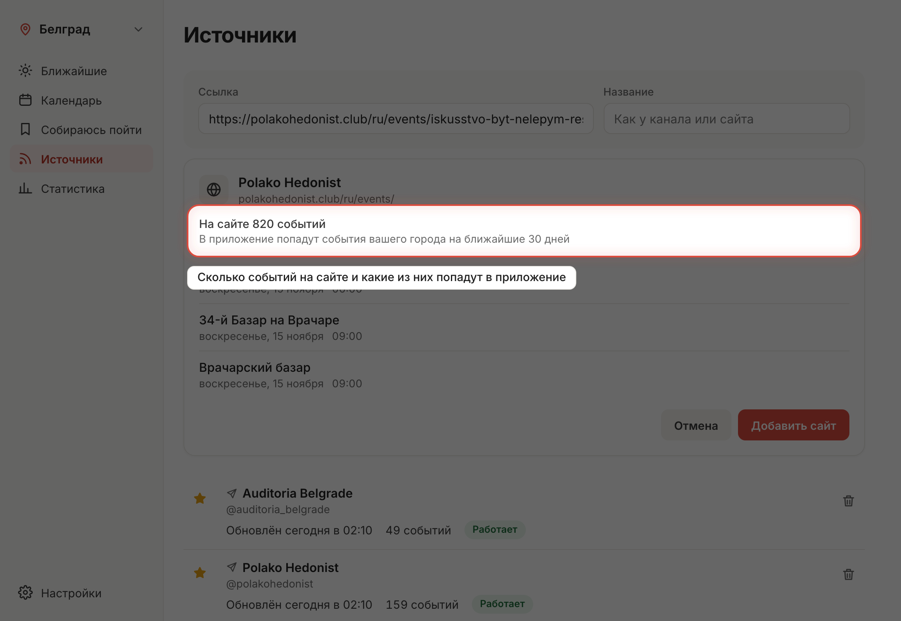
- A website is added right after the preview, without a second check.
- When a website asks to slow down, the app waits and downloads every page instead of skipping them.
- Upcoming events of a website are rechecked once a day, so **Refresh** no longer drags on for extra minutes.
- Website descriptions are shown as plain text, without markup.

### Fixed
- Website links with and without www count as one website.
- An event the website published later than its page still makes it into the app.

## 1.10.0 — 2026-11-15

Events can now come not only from Telegram channels but also from event websites.

### Event websites
In **Sources**, paste a link to any event on an event website. The app finds the site's list of all events by itself and shows how many pages it found and which events are coming up. After **Add website**, the site appears in the list next to the channels, and **Refresh** takes its events for the next 30 days. They merge with the same events from channels. Sites that mark up their events for search engines work, such as Polako Hedonist. If a site can't do that, the app says so right away.
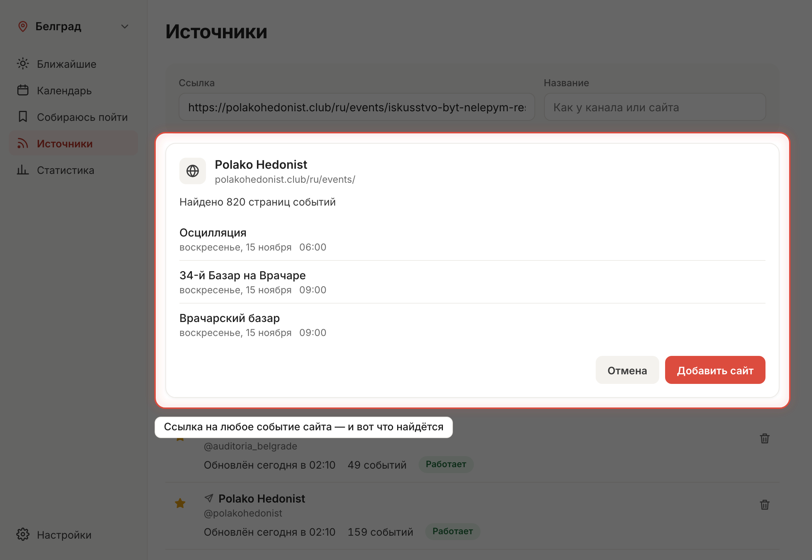
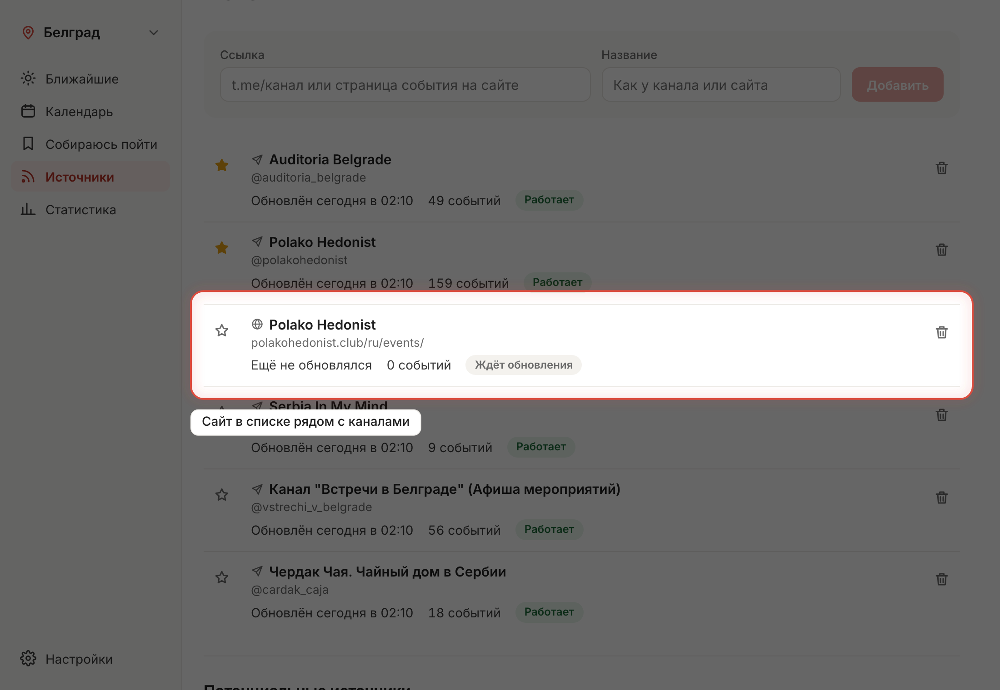

### Improvements
- Website events have an **Open on website** button that leads to the event's page.
- A channel or website that is already among your sources is not added a second time: the app warns you.

## 1.9.1 — 2026-11-15

Fixed the strip under the window title.

### Fixed
- In the macOS app, scrolled cards and events no longer show through the title bar strip with the close buttons. In **Calendar**, the area above the pinned row of days is now clean.

## 1.9.0 — 2026-11-15

The interface responds to every action: buttons react to presses, windows and menus fade in and out smoothly, and **Calendar** is easier to use.

### Calendar
- The weekdays stay at the top when you scroll a long week.
- When a search finds nothing in this week, the calendar says so and tells you how many such events are in **Upcoming**.

- Long Latin names break by syllables ("Shcher-ba-kova") rather than after any letter.
- The week grid no longer runs past the edges of the screen.

### Improvements
- All buttons, chips, ratings and menu items show a press. Ones that are switched on keep their color while pressed.
- Every element responds to hover, including active filters, marked events in **Calendar**, **Upcoming / Past** and **+ Add city**. They all respond at the same speed.
- Windows close as smoothly as they open. Menus appear and disappear with a short animation.
- The **Summary / Original** switch in the event window looks the same as **Upcoming / Past**.
- In **Want to go**, the **Upcoming / Past** switch moved to the header, and the filters fit on one line.
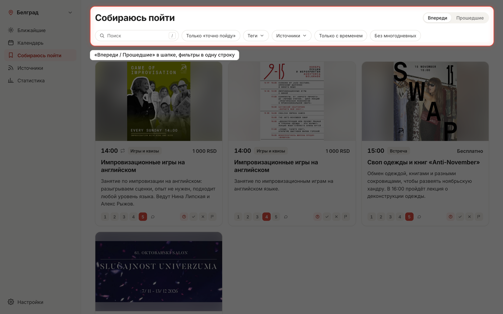
- Cards in one row have the same height, and ratings and statuses line up.

- Input fields are as tall as the buttons next to them. In **Settings**, the model picker lines up with the fields above it.

## 1.8.1 — 2026-11-15

Fixed visual glitches on the **Sources**, **Calendar** and **Stats** screens and in the filter menu.

### Fixed
- **Sources**: the refresh date and the event count no longer break onto two lines, and the columns line up.

- **Calendar**: in a narrow window, long Latin names break with a hyphen instead of splitting mid-word.
- **Stats**: in a narrow window, the four tiles at the top form a 2 × 2 grid, with no lonely tile in the second row.

- **Stats**: short bars in **Tags** and **Sources** no longer look like clipped semicircles.
- The filter menu is wider, and the checkbox sits at the first line of a long channel name.
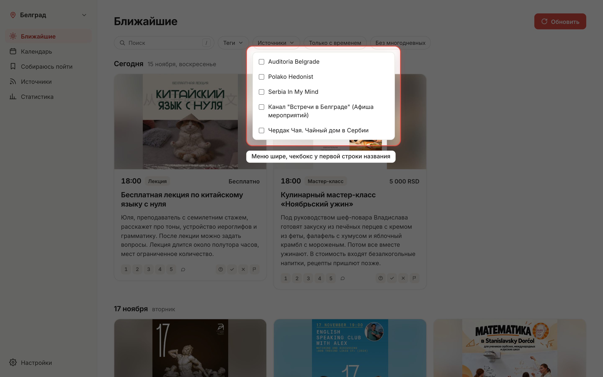

## 1.8.0 — 2026-11-14

Tags can now be hidden from the feed and arranged in your own order.

### Tag blacklist and order
In **Settings**, tags became a list. Click the eye next to a tag to put it on the blacklist, and events with it disappear from the feed. Events you have already marked stay in **Want to go**, even if they have a hidden tag. Drag a tag by the handle on the left to change the order: tags are shown in this order on cards and in the event window, and a card with several tags shows the one that matters most to you.

## 1.7.1 — 2026-11-12

Fix: events show their original post again.

### Fixed
- The **Original** tab was empty, and the **Open post** button disappeared from the event window. This happened when another program on the computer used the same port as the app: post requests went to it. Now the app talks only to its own server and checks at startup that it is the one answering.
- If posts still fail to load, the **Original** tab says so and offers a **Try again** button instead of pretending to be empty.
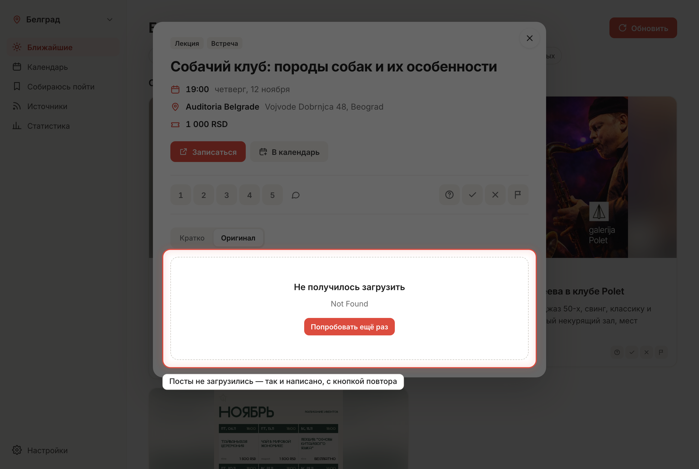

## 1.7.0 — 2026-11-11

A new **Stats** screen: everything the app has read and found, in numbers and charts.

### Stats
The menu has a new **Stats** section. At the top are the main numbers: how many posts and photos Claude read, how many events were found and how many of them you marked. Below is the path from a post to your plans: how many announcements the posts had and how many cards remained after merging duplicates. There are also the statuses and interest ratings of your cards, posts by week, the most frequent tags and how many events each channel brings. Hover over a bar to see the exact numbers.
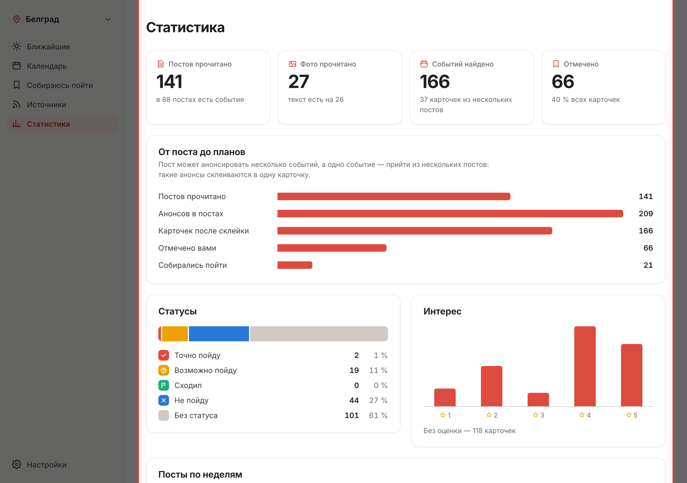

## 1.6.2 — 2026-11-10

Search finds any card, however it is marked.

### Fixed
- A card marked **Not going** used to be impossible to find anywhere, even with search, and there was nowhere to remove the mark. Now search on any screen finds cards with any mark. In **Calendar**, **Not going** cards are crossed out, and in the feed their mark is visible and can be removed. Without a search, everything shows as before.

## 1.6.1 — 2026-11-10

Photos on the cards of events from posts with one shared cover, and a more reliable update button.

### Fixed
- If a post has one photo and Claude gave it to none of its events, such as a cover for "Which museums to visit for free on November 11", it is now on the card of every event from that post. Cards you already have get it on the next refresh, without Claude calls.
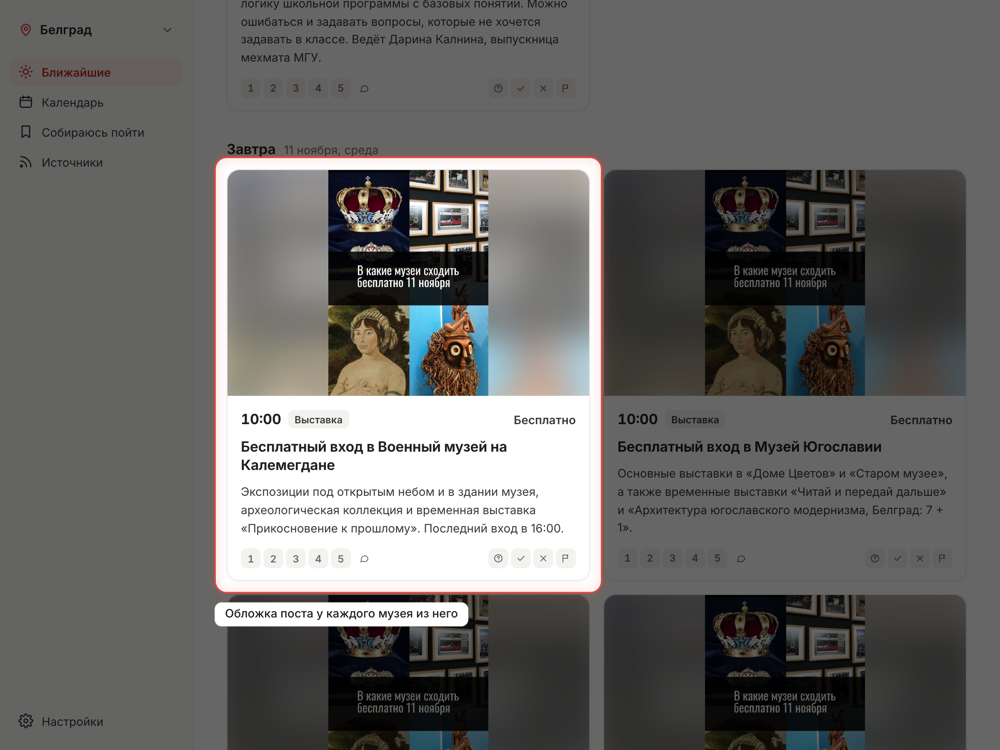
- The **Update to…** button sometimes showed that the update had failed even though it was going fine. This fix takes effect from the update after this one.

## 1.6.0 — 2026-11-10

A potential source is added with one button.

### Add or dismiss in one click
Each potential source now has two buttons instead of a checkbox. **Add to sources** adds the channel to your sources right away, and it leaves the list. **Not interesting** moves the channel to the collapsed **Dismissed** block, where you can bring it back from. If a channel could not be added, for example because it is private or has its web preview turned off, it stays in the list with the reason below it.

## 1.5.1 — 2026-11-10

A photo for every lecture of a series, and editing prompts without extra Claude calls.

### Fixed
- If a post announces a lecture series with one shared poster, that poster is now on the card of every lecture, not only the first. Cards you already have get it on the next refresh, without Claude calls.

### Improvements
- Editing prompts in **Settings** no longer rereads posts that were already parsed: the new text applies to new posts, and a refresh does not spend extra Claude calls.

## 1.5.0 — 2026-11-10

Sources can be starred, so you don't get lost among many channels.

### Favorite sources
Each channel on the **Sources** page has a star. A new channel is added without it, and clicking the star makes it a favorite: favorites stand at the top of the list. Clicking again removes the mark. The star is only for your own organizing and affects neither the refresh nor the feed.
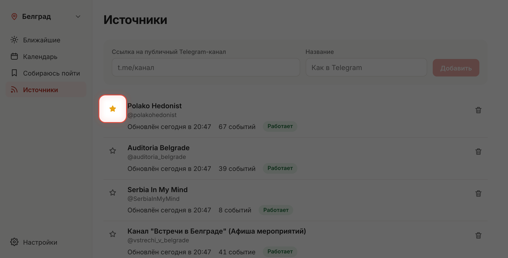

## 1.4.2 — 2026-11-10

The rating buttons on a card are back on one line.

### Fixed
- In a narrow feed column, the 1–5 rating, the note and the status buttons fit on one line instead of wrapping.

## 1.4.1 — 2026-11-10

An internal fix for sign-up links.

### Fixed
- The sign-up or ticket link of an event card is saved during a refresh without warnings in the app log.

## 1.4.0 — 2026-11-10

The app suggests new channels: the ones your sources forward posts from or link to.

### Potential sources
During a refresh, Claude notes the channels a post links to and the channels it was forwarded from. They are collected on the **Sources** page in the **Potential sources** section. Each channel shows which posts it came from, and both the channel and those posts open by link. If you like a channel, add it by hand as usual. Mark it **Done**, and the channel won't appear again. Channels already among your sources and bots don't make the list.

### Improvements
- To collect channels from posts already read, the first refresh after installing rereads the recent posts of every channel.

## 1.3.1 — 2026-11-10

The feed and the event window respond instantly, and nothing jumps.

### Fixed
- A card's hover shadow appears and disappears instantly, and the photos on this and neighboring cards no longer jump.
- The event window opens complete right away: no intermediate "Loading…", no jump in size and shadow, buttons and photos in place from the first frame.
- While the event window is open, the section under it stays highlighted in the menu.

## 1.3.0 — 2026-11-10

You can leave a note to the developer on a card: what to improve in this event or in the app.

### Notes to the developer
Next to the 1–5 interest scale there is a new button with a speech bubble. It opens a window where you can write any text, such as "this needs a new tag" or "the time was parsed wrong". Notes are collected in the database for future improvements and are not shown anywhere else in the app.
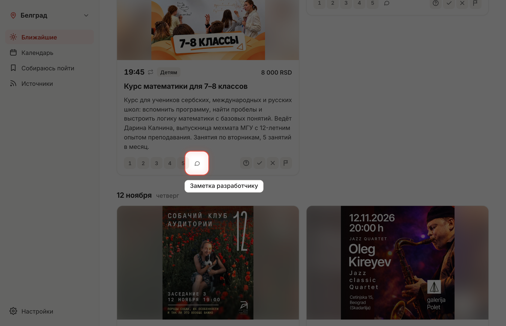

## 1.2.0 — 2026-11-10

The event window shows the original posts, so you can compare what Claude wrote with what the channel wrote.

### New event window
At the top is the gist: title, time, place, price, the sign-up button and the **Add to Calendar** button. Below are two tabs. **Summary** has the poster and the description. **Original** has the post itself: all its photos and its text as is, with the lines about this event highlighted and the post scrolled straight to them. If several channels wrote about the event, the posts are picked with chips at the top.

### New
- A **Sign up** or **Buy ticket** button when the post has a sign-up or ticket link.
- Any photo opens large, next to the text Claude read on it.

### Improvements
- An event can now be added to the calendar with a separate button.

## 1.1.0 — 2026-11-10

Post photos are read separately, and the Claude model for each step is chosen in the settings.

### New
- **Settings → Claude models**: pick Haiku, Sonnet or Opus for reading photos, parsing posts and merging duplicates.
- Your own prompt for reading photos in **Claude prompts**.

### Improvements
- Text from posters and images is transcribed in a separate step and saved, so the full description from a poster is no longer lost. While a refresh runs, the button shows "Reading photos: N of M".

### Fixed
- The app is called What To Do.

## 1.0.0 — 2026-11-10

The first release: What To Do got versions, its own macOS app and one-button updates.

### macOS app
What To Do opens in its own window, without a browser. The app starts the server on launch and stops it on quit. The menu has **Settings…** (⌘,), **Check for Updates…**, zoom and page reload.

### One-button updates
Once a day the app checks whether a new version is out. If it is, **New version** appears in the sidebar. It opens the list of changes with an **Update** button. While the update runs, you see its stages. After the update, **What's new** is shown once. The whole change history is in **Settings → App**.
